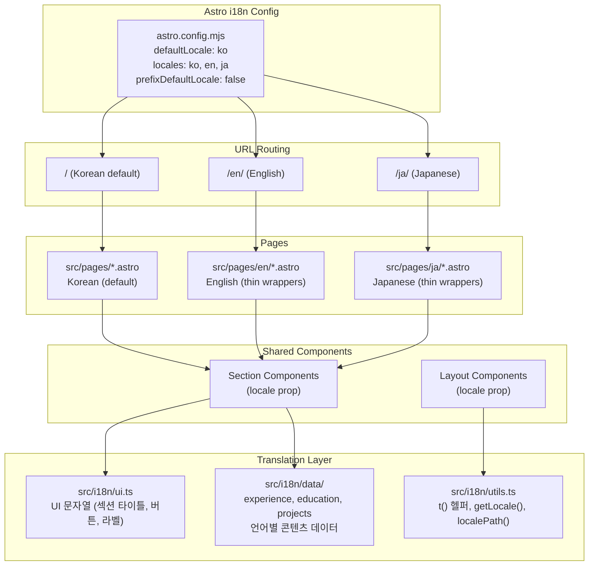

# i18n (한국어/영어/일본어) 설계문서

## 목적

포트폴리오 사이트를 한국어(기본), 영어, 일본어로 제공하여 글로벌 채용 시장에서의 접근성을 높인다.

**성공 기준**: 3개 언어로 전 페이지가 정상 렌더링되고, 언어 전환 시 현재 페이지의 해당 언어 버전으로 이동한다.

## 용어 정의

| 용어 | 설명 |
|------|------|
| locale | 언어 코드. 이 프로젝트에서는 `"ko"`, `"en"`, `"ja"` 중 하나 |
| thin wrapper | 최소한의 코드만 가진 페이지 파일. 실제 렌더링은 공유 컴포넌트에 위임하고, 자신은 `locale` 값만 지정하여 전달한다 |
| slug | URL 경로의 마지막 세그먼트. 예: `/projects/ai-assessment`에서 `ai-assessment` |
| hreflang | 검색 엔진에 같은 페이지의 다른 언어 버전을 알려주는 HTML `<link>` 태그. 예: `<link rel="alternate" hreflang="en" href="/en/" />` |
| `t()` | translation의 약자. 키와 locale을 받아 해당 언어의 문자열을 반환하는 헬퍼 함수 |

## 아키텍처



## 데이터 흐름

1. **사용자 접속**: URL 경로에서 locale 결정 (`/` → ko, `/en/` → en, `/ja/` → ja)
2. **페이지 렌더링**: 페이지에서 `locale`을 결정하여 컴포넌트에 prop으로 전달
3. **번역 조회**: 컴포넌트가 `t(key, locale)` 또는 `getData(locale)` 호출
4. **HTML 생성**: Astro가 빌드 시 정적 HTML 생성 (3개 언어 × 페이지 수)
5. **언어 전환**: Language switcher가 `localePath(currentPath, targetLocale)`로 URL 생성하여 이동

## API 설계

정적 사이트이므로 서버 API는 해당 없음. 번역 유틸리티의 인터페이스와 사용 예시:

### 인터페이스

```typescript
// src/i18n/utils.ts
type Locale = "ko" | "en" | "ja";

function getLocaleFromUrl(url: URL): Locale;
function t(key: string, locale: Locale): string;
function localePath(path: string, locale: Locale): string;
function getProjectData(slug: string, locale: Locale): ProjectContent;
```

### 예시 1: UI 번역 데이터 구조 (`ui.ts`)

```typescript
// src/i18n/ui.ts
export const ui = {
  ko: {
    "nav.resume": "Resume",
    "nav.projects": "Projects",
    "nav.contact": "Contact",
    "hero.name": "김강남",
    "hero.role": "AI Engineer",
    "hero.cta.projects": "프로젝트 보기",
    "hero.cta.aidev": "AI와 일하는 법",
    "hero.cta.contact": "연락하기",
    "projects.filter.company": "회사",
    "projects.filter.side": "사이드",
    "projects.filter.reset": "초기화",
    "layout.backToMain": "메인으로 돌아가기",
  },
  en: {
    "nav.resume": "Resume",
    "nav.projects": "Projects",
    "nav.contact": "Contact",
    "hero.name": "Kangnam Kim",
    "hero.role": "AI Engineer",
    "hero.cta.projects": "View Projects",
    "hero.cta.aidev": "How I Work with AI",
    "hero.cta.contact": "Contact",
    "projects.filter.company": "Company",
    "projects.filter.side": "Side",
    "projects.filter.reset": "Reset",
    "layout.backToMain": "Back to Main",
  },
  ja: {
    "nav.resume": "Resume",
    "nav.projects": "Projects",
    "nav.contact": "Contact",
    "hero.name": "キム・カンナム",
    "hero.role": "AI Engineer",
    "hero.cta.projects": "プロジェクトを見る",
    "hero.cta.aidev": "AIとの協業",
    "hero.cta.contact": "お問い合わせ",
    "projects.filter.company": "企業",
    "projects.filter.side": "サイド",
    "projects.filter.reset": "リセット",
    "layout.backToMain": "メインに戻る",
  },
} as const;
```

`t("hero.name", "ja")` 호출 시 반환값: `"キム・カンナム"`

### 예시 2: 컴포넌트에서 `t()` 호출

```astro
---
// src/components/sections/Hero.astro
import { t } from "../../i18n/utils";
import type { Locale } from "../../i18n/utils";

interface Props { locale: Locale; }
const { locale } = Astro.props;
---

<h1>{t("hero.name", locale)}</h1>
<p>{t("hero.role", locale)}</p>
<a href={localePath("/projects", locale)}>
  {t("hero.cta.projects", locale)}
</a>
```

locale이 `"en"`이면 출력:

```html
<h1>Kangnam Kim</h1>
<p>AI Engineer</p>
<a href="/en/projects">View Projects</a>
```

### 예시 3: thin wrapper 페이지

한국어 페이지(기존)와 동일한 컴포넌트를 사용하되, `locale`만 다르게 전달한다:

```astro
---
// src/pages/en/index.astro (thin wrapper)
import BaseLayout from "../../layouts/BaseLayout.astro";
import Navbar from "../../components/layout/Navbar.astro";
import Footer from "../../components/layout/Footer.astro";
import Hero from "../../components/sections/Hero.astro";
import About from "../../components/sections/About.astro";
import Experience from "../../components/sections/Experience.tsx";
import Skills from "../../components/sections/Skills.tsx";
import Education from "../../components/sections/Education.astro";
import AiDevCta from "../../components/sections/AiDevCta.astro";

const locale = "en";
---

<BaseLayout title="Kangnam Kim | AI Engineer" locale={locale}>
  <Navbar locale={locale} />
  <main>
    <Hero locale={locale} />
    <About locale={locale} />
    <Experience client:visible locale={locale} />
    <Skills client:visible locale={locale} />
    <Education locale={locale} />
    <AiDevCta locale={locale} />
  </main>
  <Footer locale={locale} />
</BaseLayout>
```

빌드 시 `dist/en/index.html`이 생성된다. 한국어 페이지(`dist/index.html`)와 동일한 구조이되 모든 텍스트가 영어로 렌더링된다:

```html
<html lang="en">
  <head>
    <title>Kangnam Kim | AI Engineer</title>
    <link rel="alternate" hreflang="ko" href="/" />
    <link rel="alternate" hreflang="ja" href="/ja/" />
  </head>
  <body>
    <h1>Kangnam Kim</h1>
    <p>AI Engineer</p>
    <a href="/en/projects">View Projects</a>
  </body>
</html>
```

### 예시 4: 동적 프로젝트 라우트

16개 개별 프로젝트 페이지를 하나의 동적 라우트로 통합한다:

```astro
---
// src/pages/projects/[slug].astro
import ProjectLayout from "../../layouts/ProjectLayout.astro";
import { getProjectData, getAllProjectSlugs } from "../../i18n/data/projects";

export function getStaticPaths() {
  return getAllProjectSlugs().map((slug) => ({ params: { slug } }));
}

const { slug } = Astro.params;
const project = getProjectData(slug, "ko");
---

<ProjectLayout
  title={project.title}
  company={project.company}
  period={project.period}
  role={project.role}
  tags={project.tags}
  github={project.github}
  locale="ko"
>
  <Fragment set:html={project.contentHtml} />
</ProjectLayout>
```

프로젝트 데이터는 다음과 같이 구조화된다:

```typescript
// src/i18n/data/projects.ts (일부)
export const projects = {
  "ai-assessment": {
    ko: {
      title: "AI 자동평가 시스템",
      company: "크레버스 (청담 러닝)",
      description: "Azure ML 기반 실시간 추론 시스템 배포...",
      contentHtml: `<h2>프로젝트 개요</h2><p>...</p>`,
      // ...
    },
    en: {
      title: "AI Auto-Assessment System",
      company: "Creverse (Chungdahm Learning)",
      description: "Real-time inference system deployment on Azure ML...",
      contentHtml: `<h2>Project Overview</h2><p>...</p>`,
      // ...
    },
    ja: {
      title: "AI自動評価システム",
      company: "クレバース（チョンダムラーニング）",
      description: "Azure MLベースのリアルタイム推論システム...",
      contentHtml: `<h2>プロジェクト概要</h2><p>...</p>`,
      // ...
    },
  },
  // ... 나머지 15개 프로젝트
};
```

빌드 시 생성되는 URL 경로:

| slug | 한국어 (default) | 영어 | 일본어 |
|------|-----------------|------|--------|
| `ai-assessment` | `/projects/ai-assessment` | `/en/projects/ai-assessment` | `/ja/projects/ai-assessment` |
| `ue5-mcp` | `/projects/ue5-mcp` | `/en/projects/ue5-mcp` | `/ja/projects/ue5-mcp` |

총 16 slug × 3 locale = 48개 정적 HTML 페이지가 생성된다.

### 예시 5: 언어 전환 컴포넌트

```astro
---
// src/components/ui/LanguageSwitcher.astro
import { localePath } from "../../i18n/utils";
import type { Locale } from "../../i18n/utils";

interface Props { locale: Locale; currentPath: string; }
const { locale, currentPath } = Astro.props;

const languages = [
  { code: "ko" as Locale, label: "한국어" },
  { code: "en" as Locale, label: "English" },
  { code: "ja" as Locale, label: "日本語" },
];
---

<div class="flex gap-2">
  {languages.map((lang) => (
    <a
      href={localePath(currentPath, lang.code)}
      class={locale === lang.code ? "font-bold text-primary" : "text-secondary"}
    >
      {lang.label}
    </a>
  ))}
</div>
```

`locale="en"`, `currentPath="/en/projects"`일 때 렌더링 결과:

```html
<div class="flex gap-2">
  <a href="/projects" class="text-secondary">한국어</a>
  <a href="/en/projects" class="font-bold text-primary">English</a>
  <a href="/ja/projects" class="text-secondary">日本語</a>
</div>
```

현재 언어(English)가 강조 표시되고, 다른 언어 링크는 같은 페이지의 해당 언어 버전을 가리킨다.

## 파일 구조

```
src/
├── i18n/
│   ├── utils.ts                    # t(), getLocaleFromUrl(), localePath()
│   ├── ui.ts                       # UI 문자열 번역 (섹션 타이틀, 버튼, 라벨)
│   └── data/
│       ├── experience.ts           # 경력 데이터 (ko/en/ja)
│       ├── education.ts            # 학력 데이터 (ko/en/ja)
│       ├── projects.ts             # 프로젝트 목록 + 상세 콘텐츠 (ko/en/ja)
│       └── about.ts                # About 섹션 텍스트 (ko/en/ja)
├── pages/
│   ├── index.astro                 # (기존, locale="ko" 추가)
│   ├── contact.astro               # (기존, locale="ko" 추가)
│   ├── ai-dev.astro                # (기존, locale="ko" 추가)
│   ├── projects/
│   │   ├── index.astro             # (기존, locale="ko" 추가)
│   │   └── [slug].astro            # 동적 라우트 (16개 프로젝트 통합)
│   ├── en/                         # 영어 thin wrapper 페이지
│   │   ├── index.astro
│   │   ├── contact.astro
│   │   ├── ai-dev.astro
│   │   └── projects/
│   │       ├── index.astro
│   │       └── [slug].astro
│   └── ja/                         # 일본어 thin wrapper 페이지
│       ├── index.astro
│       ├── contact.astro
│       ├── ai-dev.astro
│       └── projects/
│           ├── index.astro
│           └── [slug].astro
├── components/
│   ├── layout/
│   │   ├── Navbar.astro            # locale prop 추가 + LanguageSwitcher 포함
│   │   └── Footer.astro            # locale prop 추가
│   ├── sections/
│   │   ├── Hero.astro              # locale prop → t() 사용
│   │   ├── About.astro             # locale prop → 번역 데이터 사용
│   │   ├── Experience.tsx          # locale prop 추가
│   │   ├── Skills.tsx              # locale prop 추가
│   │   ├── Education.astro         # locale prop 추가
│   │   ├── Contact.astro           # locale prop 추가
│   │   ├── Projects.tsx            # locale prop → 번역 데이터 사용
│   │   ├── AiWorkflow.tsx          # locale prop → 번역 데이터 사용
│   │   └── AiDevCta.astro          # locale prop 추가
│   └── ui/
│       ├── LanguageSwitcher.astro   # 신규: 언어 전환 UI
│       └── TypeWriter.tsx           # texts prop은 이미 외부에서 받음 (변경 불필요)
└── layouts/
    ├── BaseLayout.astro             # locale prop → lang 속성, og 태그, hreflang
    └── ProjectLayout.astro          # locale prop → 번역 적용
```

## 의사결정 근거

### 채택: Astro 내장 i18n + 수동 번역 파일 (TypeScript)

- Astro 6의 `i18n` 설정으로 라우팅 처리 (추가 라이브러리 불필요)
- TypeScript 번역 파일로 타입 안전성 확보
- 정적 빌드이므로 런타임 오버헤드 없음

### 기각: i18n 라이브러리 (astro-i18n-aut, paraglide 등)

- 사이트 규모가 작아 외부 의존성 추가 대비 이점 적음
- 번역 키가 약 200개 수준으로 수동 관리 가능
- 기각 이유: 불필요한 복잡성 추가

### 채택: 프로젝트 페이지 동적 라우트 ([slug].astro)

- 현재 16개 개별 .astro 파일 → 1개 동적 라우트로 통합
- 프로젝트 콘텐츠를 데이터 파일로 분리하여 번역 관리 용이
- 16 × 3 = 48개 파일 대신 3개 파일로 처리

### 기각: 프로젝트 페이지 개별 유지

- 16 × 3 = 48개 파일 필요, 유지보수 부담 과도
- 기각 이유: 확장성 부족, 중복 코드 과다

### 채택: prefixDefaultLocale: false

- 한국어(기본)는 `/`에서 접근 (기존 URL 유지, SEO 영향 없음)
- 영어는 `/en/`, 일본어는 `/ja/`
- 기존 링크 호환성 100% 유지

### 기각: prefixDefaultLocale: true (/ko/ 접두사)

- 기존 URL이 모두 변경되어 SEO 영향
- 리다이렉트 설정 필요
- 기각 이유: 기존 URL 깨짐

## 사전 조건

- **Astro 6**: 현재 설치됨 (`"astro": "^6.0.6"`)
- **Node.js 22+**: 현재 설정됨 (`"engines": { "node": ">=22.12.0" }`)
- 추가 패키지 설치 불필요 (Astro 내장 i18n 사용)

## 구현 순서

### Phase 1: 인프라 (i18n 설정 + 번역 시스템 + 언어 스위처)
1. `astro.config.mjs`에 i18n 설정 추가
2. `src/i18n/utils.ts` 헬퍼 함수 생성
3. `src/i18n/ui.ts` UI 번역 키 생성 (한국어 값 먼저 채우고, 영어/일본어 번역)
4. `src/components/ui/LanguageSwitcher.astro` 생성
5. `BaseLayout.astro`에 locale prop 추가 (lang 속성 + hreflang 태그)
6. `Navbar.astro`에 locale prop + LanguageSwitcher 연결

### Phase 2: 메인 페이지 (4개)
1. 섹션 컴포넌트에 locale prop 추가 (Hero, About, Experience, Skills, Education, Contact, AiDevCta)
2. `src/i18n/data/` 번역 데이터 파일 생성 (experience.ts, education.ts, about.ts)
3. `src/pages/en/`, `src/pages/ja/` thin wrapper 생성 (index, contact, ai-dev, projects/index)
4. 영어/일본어 번역 채우기 — AI 번역 초안 생성 후 키 포인트 수동 검수

### Phase 3: 프로젝트 페이지 (16개 → 동적 라우트)
1. 16개 프로젝트 .astro 파일의 콘텐츠를 `src/i18n/data/projects.ts`로 추출
2. `src/pages/projects/[slug].astro` 동적 라우트 생성
3. 기존 16개 개별 프로젝트 .astro 파일 삭제
4. `src/pages/en/projects/[slug].astro`, `ja/projects/[slug].astro` 생성
5. AiWorkflow.tsx 번역 데이터 분리

### Phase 4: 검증 + 정리
1. `npm run build`로 전체 빌드 테스트 (3개 언어 × 전 페이지)
2. `npm run preview`로 언어 전환 동작 확인
3. 각 언어별 SEO 메타태그 (og:title, og:description) 적용 확인
4. hreflang 태그가 모든 페이지에 올바르게 삽입되었는지 확인

## 트러블슈팅

### 빌드 시 "Missing locale" 에러
`astro.config.mjs`의 `locales` 배열에 사용 중인 locale이 모두 포함되어 있는지 확인한다. `src/pages/en/` 디렉토리가 있지만 `locales`에 `"en"`이 없으면 발생한다.

### 동적 라우트에서 404
`getStaticPaths()`가 반환하는 slug 목록이 `projects.ts`의 키와 일치하는지 확인한다. slug에 오타가 있으면 해당 프로젝트 페이지가 빌드되지 않는다.

### 언어 전환 시 404
`localePath()` 함수가 기본 locale(ko)일 때 접두사를 붙이지 않도록 구현되어 있는지 확인한다. 예: `localePath("/projects", "ko")`는 `/projects`를 반환해야 하고, `/ko/projects`를 반환하면 안 된다.
