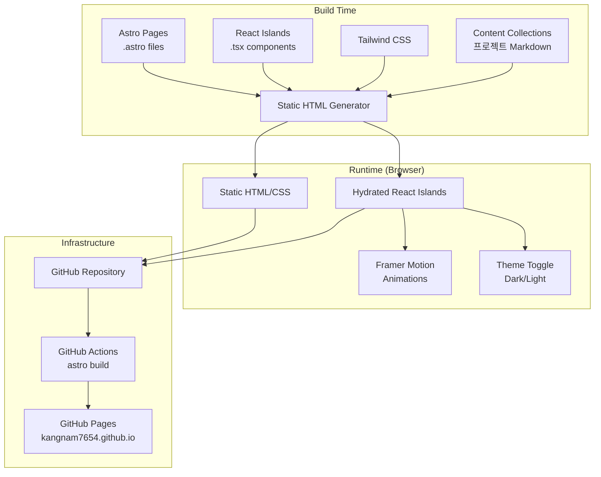
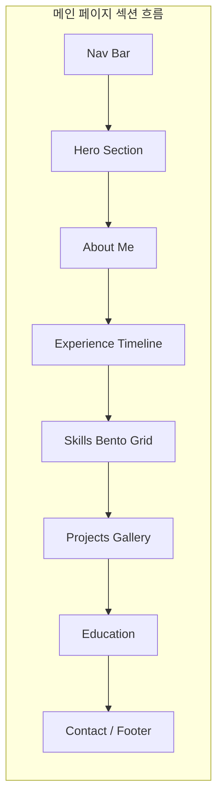
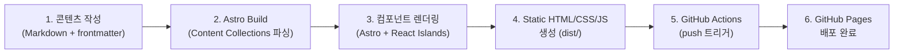
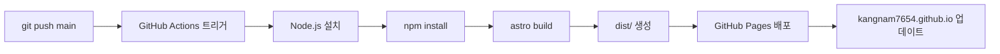

# 포트폴리오 웹사이트 설계문서

## 용어 정의

이 문서에서 사용하는 주요 용어를 먼저 정리한다.

| 용어 | 설명 |
|------|------|
| **Astro** | 정적 사이트 생성 프레임워크. HTML 우선으로 동작하여 빠르고, 필요한 곳에만 JavaScript를 추가할 수 있다 |
| **Islands Architecture** | Astro의 핵심 개념. 페이지 대부분은 정적 HTML이고, 인터랙션이 필요한 부분만 독립적인 "섬(island)"처럼 JavaScript 컴포넌트를 배치하는 방식. 전체 페이지를 JavaScript로 감싸는 React SPA와 대비된다 |
| **하이드레이션 (Hydration)** | 서버에서 생성된 정적 HTML에 JavaScript를 연결하여 인터랙티브하게 만드는 과정. 예: 정적으로 렌더링된 버튼에 클릭 이벤트를 붙이는 것 |
| **Content Collections** | Astro가 제공하는 콘텐츠 관리 기능. Markdown 파일을 구조화된 데이터로 자동 변환해준다. 프로젝트 포트폴리오를 `.md` 파일로 작성하면 자동으로 페이지가 생성된다 |
| **Glassmorphism** | 반투명 유리처럼 보이는 UI 디자인 스타일. 배경이 흐릿하게 비치면서 카드가 떠 있는 듯한 깊이감을 준다 |
| **Bento Grid** | 일본 도시락(弁当) 박스처럼 다양한 크기의 카드를 모듈형으로 배치하는 레이아웃. Apple 제품 페이지에서 대중화됨 |
| **Framer Motion** | React 전용 애니메이션 라이브러리. `<motion.div>` 태그로 감싸면 페이드인, 슬라이드, 스프링 효과 등을 간단히 적용할 수 있다 |
| **Tailwind CSS** | CSS 유틸리티 클래스 프레임워크. `class="text-white bg-blue-500 p-4"`처럼 HTML에 직접 스타일 클래스를 적용하여 빠르게 디자인한다 |
| **SPA (Single Page Application)** | 페이지 전체를 하나의 HTML로 로드한 뒤, 이후 화면 전환을 JavaScript로 처리하는 웹 앱 방식. 초기 로딩이 느리고 검색 엔진 최적화에 불리한 단점이 있다 |
| **SEO (Search Engine Optimization)** | 검색 엔진 최적화. Google 등의 검색 엔진이 웹페이지를 잘 인식하고 상위에 노출하도록 구조를 개선하는 작업 |
| **SSR / ISR** | SSR(Server-Side Rendering)은 서버에서 HTML을 생성하여 브라우저에 전달하는 방식. ISR(Incremental Static Regeneration)은 정적 페이지를 일정 주기로 서버에서 재생성하는 Next.js 기능. 둘 다 서버가 필요하여 GitHub Pages에서는 사용 불가 |
| **CI/CD** | Continuous Integration / Continuous Deployment. 코드 변경 사항을 자동으로 빌드, 테스트, 배포하는 파이프라인. 이 프로젝트에서는 GitHub Actions가 CI/CD 역할을 수행한다 |
| **뷰포트 (Viewport)** | 브라우저에서 현재 사용자에게 보이는 화면 영역. 스크롤하면 뷰포트 밖의 콘텐츠가 뷰포트 안으로 진입한다 |
| **디렉티브 (Directive)** | Astro 컴포넌트에 부여하는 특수 속성. 예: `client:visible`은 "이 컴포넌트가 뷰포트에 진입하면 JavaScript를 로드하라"는 의미이다 |
| **Lighthouse** | Google이 제공하는 웹페이지 품질 측정 도구. Performance, Accessibility 등 항목을 0~100점으로 채점한다. Chrome DevTools(F12)에서 실행 가능 |
| **frontmatter** | Markdown 파일 최상단에 `---`로 감싸서 작성하는 메타데이터 영역. YAML 형식으로 제목, 날짜, 태그 등 구조화된 정보를 기술한다 |
| **slug** | URL 경로에 사용되는 고유 식별 문자열. 예: `ai-auto-assessment.md` 파일의 slug는 `ai-auto-assessment`이며, `/projects/ai-auto-assessment` URL로 접근된다 |
| **라우팅 (Routing)** | URL 경로와 페이지를 연결하는 메커니즘. `/projects/[slug]`처럼 경로 패턴을 정의하면 해당 URL 접근 시 대응하는 페이지를 표시한다 |
| **번들 (Bundle)** | 여러 소스 파일(JS, CSS 등)을 하나 또는 소수의 파일로 묶는 빌드 결과물. 번들 크기가 작을수록 페이지 로딩이 빨라진다 |
| **localStorage** | 브라우저에 내장된 키-값 저장소. 페이지를 새로고침하거나 브라우저를 닫아도 데이터가 유지된다. 이 프로젝트에서는 사용자의 다크/라이트 모드 선택을 저장하는 용도로 사용 |
| **CTA (Call To Action)** | 사용자의 행동을 유도하는 버튼이나 링크. "프로젝트 보기", "이력서 다운로드"처럼 방문자가 다음 단계로 진행하도록 안내하는 UI 요소 |
| **GSAP (GreenSock Animation Platform)** | JavaScript 기반 고성능 웹 애니메이션 라이브러리. 스크롤 트리거, 타임라인 등 정교한 애니메이션을 구현할 수 있다. 이 프로젝트에서는 채택하지 않았으나 대안으로 검토됨 |
| **클리핑 (Clipping)** | 이미지나 요소를 특정 형태(원형, 사각형 등)로 잘라내어 해당 영역만 표시하는 기법. 원형 클리핑은 프로필 사진을 동그랗게 잘라 보여주는 데 사용된다 |
| **글로우 (Glow)** | 요소 주변에 빛이 번지는 듯한 발광 효과. CSS의 `box-shadow`로 구현하며, 시각적 강조에 사용된다 |
| **파티클 (Particle)** | 화면에 떠다니는 작은 점이나 도형 애니메이션. 배경에 미세한 움직임을 주어 역동적인 느낌을 연출한다 |
| **툴팁 (Tooltip)** | 마우스를 요소 위에 올리면 나타나는 작은 설명 상자. 클릭하지 않아도 추가 정보를 즉시 확인할 수 있다 |
| **오버레이 (Overlay)** | 기존 콘텐츠 위에 반투명 레이어를 덮어씌우는 기법. 카드에 마우스를 올리면 반투명 배경 위에 설명 텍스트가 나타나는 식으로 사용된다 |

---

## 1. 목적

**문제**: 현재 kangnam7654.github.io는 Google Docs 이력서로 리다이렉트하는 단순 페이지로, AI Research Engineer로서의 전문성과 프로젝트 경험을 효과적으로 전달하지 못한다.

**목표**: 인터랙티브하고 트렌디한 포트폴리오 사이트를 구축하여, 이력서 정보와 개별 프로젝트 포트폴리오를 체계적으로 보여준다.

**성공 기준**:
- 메인 페이지에서 이력서 핵심 정보(About, Experience, Skills, Education)를 한 눈에 파악 가능
- 각 프로젝트별 개별 포트폴리오 페이지 접근 가능
- 스크롤 애니메이션, 다크/라이트 모드, 반응형 디자인 등 인터랙티브 요소 적용
- Lighthouse Performance 점수 90점 이상
- 모바일/태블릿/데스크톱 모두 정상 동작

---

## 2. 전제조건 및 프로젝트 설정

### 전제조건

| 도구 | 최소 버전 | 확인 명령 | 설치 안내 |
|------|----------|----------|----------|
| Node.js | v20.11.0+ | `node --version` | [nodejs.org](https://nodejs.org/) |
| npm | v10.2.0+ | `npm --version` | Node.js에 포함 |
| Git | v2.40+ | `git --version` | 이미 설치됨 (현재 프로젝트가 Git 저장소) |

### 프로젝트 초기화

```bash
# 1. 저장소 이동
cd kangnam7654.github.io

# 2. Astro 프로젝트 생성 (기존 저장소 위에 설치)
npm create astro@latest -- --template minimal --install --typescript strict

# 3. React 통합 추가
npx astro add react

# 4. Tailwind CSS 통합 추가
npx astro add tailwind

# 5. 애니메이션 라이브러리 설치
npm install framer-motion

# 6. 개발 서버 실행
npm run dev
# → 브라우저에서 http://localhost:4321 접근
```

### 주요 명령어

| 명령어 | 설명 |
|--------|------|
| `npm run dev` | 로컬 개발 서버 실행 (http://localhost:4321) |
| `npm run build` | 정적 사이트 빌드 (dist/ 디렉토리에 출력) |
| `npm run preview` | 빌드 결과물 로컬 미리보기 |

### 트러블슈팅

| 증상 | 원인 | 해결 방법 |
|------|------|----------|
| `npm run dev` 시 `ERR_MODULE_NOT_FOUND` | Node.js 버전이 20 미만 | `node --version` 확인 후 v20.11.0 이상으로 업그레이드 |
| `astro build` 시 `Cannot find module 'react'` | React 의존성 미설치 | `npx astro add react` 실행 |
| GitHub Pages 배포 후 404 | `astro.config.mjs`에 `site` 미설정 | config에 `site: 'https://kangnam7654.github.io'` 추가 |
| Tailwind 클래스가 적용 안 됨 | Tailwind 통합 미설정 | `npx astro add tailwind` 실행 |
| 이미지가 깨짐 | 경로 오류 | `public/` 디렉토리에 이미지를 넣고 `/images/파일명`으로 참조 |

---

## 3. 아키텍처

Astro의 Islands Architecture를 활용하여 정적 HTML 기반에 인터랙티브 컴포넌트를 선택적으로 배치한다.




### 핵심 아키텍처 결정

| 계층 | 기술 | 역할 |
|------|------|------|
| 프레임워크 | Astro v5 | 정적 사이트 생성, 라우팅, Content Collections |
| UI 라이브러리 | React 19 | 인터랙티브 컴포넌트 (Islands) |
| 스타일링 | Tailwind CSS v4 | 유틸리티 기반 스타일링, 다크 모드 |
| 애니메이션 | Framer Motion | 스크롤 트리거, 호버, 페이지 전환 |
| 언어 | TypeScript | 타입 안전성 |
| 배포 | GitHub Actions + Pages | CI/CD 자동 배포 |

---

## 4. 페이지 구성

### 4.1 메인 페이지 (`/`)



#### Hero Section
- 프로필 사진 (원형 클리핑 + 글로우 효과)
- 이름: 김강남
- 직함: AI Research Engineer
- 한 줄 소개 타이핑 애니메이션
- CTA 버튼: "프로젝트 보기", "이력서 다운로드"
- 배경: 미세한 파티클 또는 그라데이션 애니메이션

#### About Me Section
- 자기소개 텍스트
- 기술 역량 키워드 태그 (호버 시 설명 툴팁)
- 스크롤 시 fade-in 애니메이션

#### Experience Timeline
- 세로 타임라인 형태
- 각 경력 카드: 회사명, 직함, 기간, 주요 성과
- 스크롤에 따라 순차적으로 나타나는 애니메이션
- 카드 호버 시 Glassmorphism 효과

#### Skills Bento Grid
- 카테고리별 모듈형 카드 배치 (Languages, Frameworks, Cloud, Tools)
- 각 카드 크기 차등 (중요도/숙련도 반영)
- 호버 시 카드 확대 + 상세 정보 표시
- Glassmorphism 카드 스타일

#### Projects Gallery
- 프로젝트 카드 그리드 (썸네일 + 제목 + 태그)
- 호버 시 오버레이로 간략 설명 표시
- 클릭 시 개별 프로젝트 페이지로 이동
- 카테고리 필터 (Vision, NLP, Audio, etc.)

#### Education Section
- 학교명, 전공, 기간
- 성적 우수 장학금 등 특이사항 표시

#### Contact / Footer
- 이메일, GitHub, LinkedIn 아이콘 링크
- 간단한 연락 안내 텍스트

### 4.2 프로젝트 상세 페이지 (`/projects/[slug]`)

- Astro Content Collections로 Markdown 기반 관리
- 프로젝트를 추가하려면 `src/content/projects/` 디렉토리에 Markdown 파일을 생성하면 된다

**프로젝트 Markdown 파일 예시** (`src/content/projects/ai-auto-assessment.md`):

```markdown
---
title: "AI 자동평가 시스템"
description: "Azure ML 기반 실시간 추론 시스템으로 MAU 3만 달성"
date: 2024-04-01
tags: ["MLOps", "LLM Agent", "Vision", "Audio", "Search"]
thumbnail: "/images/projects/ai-assessment.png"
company: "크레버스 (청담러닝)"
role: "AI 엔지니어"
---

## 개요
학생의 영어 발표를 AI로 자동 평가하는 시스템을 개발했습니다.

## 기술적 도전과 해결
...
```

이 Markdown 파일이 빌드되면 `/projects/ai-auto-assessment` URL에 프로젝트 상세 페이지가 자동 생성된다. frontmatter의 `tags`는 프로젝트 갤러리의 필터 카테고리로 사용되고, `thumbnail`은 카드의 이미지로 표시된다.

**경력 데이터 구조 예시** (`src/data/experience.ts`):

```typescript
export interface Experience {
  company: string;
  team: string;
  role: string;
  period: string;
  location: string;
  project: string;
  highlights: string[];
}

export const experiences: Experience[] = [
  {
    company: "크레버스 (청담러닝)",
    team: "Nesto CV 본부, AI Biz 팀",
    role: "AI 엔지니어",
    period: "2024.04 ~ 현재",
    location: "서울",
    project: "AI 자동평가 시스템",
    highlights: [
      "[MLOps] Azure ML 실시간 추론 시스템 배포, MAU 3만 달성",
      "[LLM Agent] Multi-Agent 합성 데이터 생성",
    ],
  },
];
```

위 데이터가 Experience Timeline 섹션에서 렌더링되면 다음과 같이 표시된다:

```
┌──────────────────────────────────────────┐
│  ● 2024.04 ~ 현재                        │
│  크레버스 (청담러닝)                       │
│  AI 엔지니어 · Nesto CV 본부, AI Biz 팀   │
│                                          │
│  • [MLOps] Azure ML 실시간 추론 시스템     │
│    배포, MAU 3만 달성                      │
│  • [LLM Agent] Multi-Agent 합성           │
│    데이터 생성                             │
└──────────────────────────────────────────┘
```

- 각 프로젝트별 구성:
  - 프로젝트 제목 + 태그
  - 개요 / 문제 정의
  - 기술 스택
  - 아키텍처 / 접근 방식
  - 결과 / 성과 (수치 포함)
  - 스크린샷 / 데모 영상
  - 회고 / 배운 점

### 4.3 공통 요소

- **Navigation Bar**: 스크롤 시 배경 blur + 축소, 현재 섹션 하이라이트
- **다크/라이트 모드 토글**: localStorage 저장, 시스템 설정 감지
- **스크롤 진행 표시바**: 상단 고정 프로그레스 바
- **커스텀 커서**: 데스크톱에서 글로우 효과 (모바일 비활성화)
- **반응형 브레이크포인트**: mobile (< 640px), tablet (640-1024px), desktop (> 1024px)

---

## 5. 디자인 시스템

### 5.1 색상 팔레트

```
Dark Mode (기본):
- Background:     #0a0a0f (깊은 네이비-블랙)
- Surface:        #1a1a2e (카드 배경)
- Surface-glass:  rgba(26, 26, 46, 0.6) + backdrop-blur
- Primary:        #00d4ff (시안 / 전기 블루)
- Secondary:      #7c3aed (보라)
- Accent:         #06ffa5 (네온 그린)
- Text-primary:   #e4e4e7
- Text-secondary: #a1a1aa

Light Mode:
- Background:     #fafafa
- Surface:        #ffffff
- Primary:        #0284c7
- Text-primary:   #18181b
- Text-secondary: #71717a
```

### 5.2 타이포그래피

```
Heading: "Plus Jakarta Sans" (Google Fonts)
Body: "Inter" (Google Fonts)
Code: "JetBrains Mono" (Google Fonts)
```

### 5.3 애니메이션 규칙

| 트리거 | 효과 | 지속 시간 |
|--------|------|-----------|
| 스크롤 진입 | fade-in + slide-up | 0.6s ease-out |
| 호버 (카드) | scale(1.02) + 그림자 증가 | 0.2s |
| 호버 (버튼) | 배경색 전환 + scale(1.05) | 0.15s |
| 페이지 전환 | fade + slide | 0.3s |
| 테마 전환 | 색상 transition | 0.3s |

### 5.4 Glassmorphism 카드 스타일

```css
.glass-card {
  background: rgba(26, 26, 46, 0.6);
  backdrop-filter: blur(12px);
  border: 1px solid rgba(255, 255, 255, 0.08);
  border-radius: 16px;
  box-shadow: 0 8px 32px rgba(0, 0, 0, 0.2);
}
```

이 스타일이 적용된 카드는 다음과 같은 시각적 효과를 가진다:

```
┌─────────────────────────────────────┐
│  ░░░░ 반투명 유리 효과 ░░░░░░░░░░░░  │  ← 뒤 배경이 흐릿하게 비침
│                                     │
│  카드 내용이 여기에 표시됨            │  ← 둥근 모서리 (16px)
│                                     │
│  ░░░░░░░░░░░░░░░░░░░░░░░░░░░░░░░░░  │  ← 미세한 테두리 + 그림자
└─────────────────────────────────────┘
```

---

## 6. 데이터 흐름



### 상세 단계

1. **콘텐츠 작성**: 프로젝트 정보를 `src/content/projects/` 내 Markdown 파일로 작성. frontmatter에 제목, 태그, 날짜, 썸네일 경로 등 메타데이터 포함
2. **빌드 프로세스**: `astro build` 실행 시 Content Collections API가 Markdown을 파싱하고, Astro 페이지 템플릿과 결합하여 HTML 생성. Tailwind CSS가 사용된 클래스만 추출하여 최소 CSS 번들 생성
3. **React Islands 하이드레이션**: `client:visible` 디렉티브가 적용된 React 컴포넌트만 뷰포트 진입 시 JavaScript 로드 및 하이드레이션. Framer Motion 애니메이션이 이 시점에 활성화
4. **정적 파일 출력**: `dist/` 디렉토리에 완전한 정적 사이트 생성 (HTML + CSS + 최소 JS)
5. **CI/CD**: main 브랜치 push 시 GitHub Actions 워크플로우가 자동으로 빌드 실행
6. **배포**: 빌드 산출물이 GitHub Pages에 배포되어 kangnam7654.github.io로 접근 가능

---

## 7. 배포 파이프라인



GitHub Actions 워크플로우 (`/.github/workflows/deploy.yml`):
- 트리거: main 브랜치 push
- Astro 공식 GitHub Pages Action 사용 (`withastro/action@v3`)
- 별도 배포 설정 불필요

---

## 8. API 설계

**해당 없음** - 정적 사이트로 서버 사이드 API 없음. 모든 데이터는 빌드 타임에 Content Collections를 통해 정적으로 생성됨.

---

## 9. 파일 구조

```
kangnam7654.github.io/
├── .github/
│   └── workflows/
│       └── deploy.yml                 # GitHub Actions 배포 워크플로우
├── public/
│   ├── images/
│   │   ├── profile.jpg               # 프로필 사진
│   │   ├── projects/                  # 프로젝트 썸네일/스크린샷
│   │   ├── image1.png                 # LinkedIn 아이콘 (기존)
│   │   └── image2.png                 # GitHub 아이콘 (기존)
│   └── favicon.svg
├── src/
│   ├── components/
│   │   ├── layout/
│   │   │   ├── Navbar.astro           # 네비게이션 바
│   │   │   ├── Footer.astro           # 푸터
│   │   │   └── ScrollProgress.tsx     # 스크롤 진행 바 (React)
│   │   ├── sections/
│   │   │   ├── Hero.astro             # 히어로 섹션
│   │   │   ├── About.astro            # 소개 섹션
│   │   │   ├── Experience.tsx         # 경력 타임라인 (React - 애니메이션)
│   │   │   ├── Skills.tsx             # 스킬 벤토 그리드 (React - 인터랙션)
│   │   │   ├── Projects.tsx           # 프로젝트 갤러리 (React - 필터/애니메이션)
│   │   │   ├── Education.astro        # 학력 섹션
│   │   │   └── Contact.astro          # 연락처 섹션
│   │   ├── ui/
│   │   │   ├── GlassCard.tsx          # Glassmorphism 카드 컴포넌트
│   │   │   ├── AnimatedSection.tsx    # 스크롤 트리거 래퍼
│   │   │   ├── ThemeToggle.tsx        # 다크/라이트 모드 토글
│   │   │   ├── CustomCursor.tsx       # 커스텀 커서
│   │   │   ├── TypeWriter.tsx         # 타이핑 애니메이션
│   │   │   └── SkillTag.tsx           # 스킬 태그 컴포넌트
│   │   └── projects/
│   │       └── ProjectCard.tsx        # 프로젝트 카드 컴포넌트
│   ├── content/
│   │   ├── config.ts                  # Content Collections 스키마 정의
│   │   └── projects/                  # 프로젝트 Markdown 파일들
│   │       ├── ai-auto-assessment.md
│   │       ├── face-to-character.md
│   │       └── ...
│   ├── data/
│   │   ├── experience.ts              # 경력 데이터
│   │   ├── skills.ts                  # 스킬 데이터
│   │   └── education.ts               # 학력 데이터
│   ├── layouts/
│   │   ├── BaseLayout.astro           # 기본 레이아웃 (head, body)
│   │   └── ProjectLayout.astro        # 프로젝트 상세 레이아웃
│   ├── pages/
│   │   ├── index.astro                # 메인 페이지
│   │   └── projects/
│   │       └── [slug].astro           # 프로젝트 동적 라우트
│   └── styles/
│       └── global.css                 # 글로벌 스타일 (Tailwind base)
├── astro.config.mjs                   # Astro 설정
├── tailwind.config.mjs                # Tailwind 설정
├── tsconfig.json                      # TypeScript 설정
├── package.json
└── docs/                              # 설계문서 (기존)
```

---

## 10. 의사결정 근거

### 채택: Astro + React Islands

**이유**:
- 기본 JS 번들 0KB로 성능 최적화에 유리 (Lighthouse 90+ 목표 달성 용이)
- Islands Architecture로 인터랙션이 필요한 컴포넌트에만 React를 선택적 적용
- GitHub Pages 공식 Action 제공으로 배포 설정 최소화
- HTML/Markdown 기반이라 프론트엔드 비전문가도 콘텐츠 관리 용이
- Content Collections로 프로젝트 포트폴리오를 Markdown 파일로 관리 가능

### 기각 1: Vite + React (SPA)

**기각 이유**:
- 빈 페이지에도 React 런타임(87KB+) 로딩 필요 → 성능 저하
- SPA 특성상 SEO가 약하고, GitHub Pages에서 클라이언트 사이드 라우팅 설정이 번거로움
- 포트폴리오 특성상 대부분 정적 콘텐츠인데 전체를 React로 감싸는 것은 과도함

### 기각 2: Plain HTML/CSS + GSAP

**기각 이유**:
- 컴포넌트 단위 코드 재사용이 불가능하여 유지보수성 떨어짐
- 프로젝트 추가 시마다 HTML 복사-붙여넣기 필요 (Content Collections 대비 열위)
- 코드 구조화 도구가 없어 파일이 늘어나면 스파게티화 위험

### 기각 3: Next.js

**기각 이유**:
- GitHub Pages 배포 시 `output: 'export'` 설정 필요 + 일부 기능 제한
- SSR/ISR 등 서버 기능이 포트폴리오에 불필요한 오버헤드
- Astro 대비 번들 크기가 크고 설정이 복잡

---

## 11. 구현 우선순위

| 단계 | 작업 | 산출물 |
|------|------|--------|
| **Phase 1** | 프로젝트 초기화 + 기본 레이아웃 | Astro 프로젝트, Tailwind 설정, BaseLayout, Navbar, Footer |
| **Phase 2** | 메인 페이지 섹션 구현 | Hero, About, Experience, Skills, Education, Contact |
| **Phase 3** | 인터랙션 적용 | Framer Motion 애니메이션, 다크 모드, 커스텀 커서, 스크롤 효과 |
| **Phase 4** | 프로젝트 포트폴리오 시스템 | Content Collections 설정, 프로젝트 상세 페이지, 갤러리 |
| **Phase 5** | 배포 + 최적화 | GitHub Actions, 이미지 최적화, Lighthouse 튜닝, 반응형 점검 |
